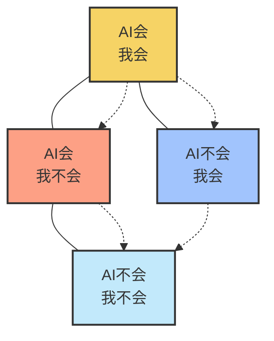

# 我与AI的四象限
前不久，我作为出品人和演讲嘉宾，有幸参与了在济南举办的IvorySQL 2025生态大会暨PostgreSQL高峰论坛。千人会场座无虚席，新朋老友齐聚一堂，探讨着数据库的当下与未来，深受启发。对我而言，感触最深的是，包括数据库在内的各行各业，都正站在一个激动人心又充满焦虑的十字路口，AI浪潮正以不可阻挡之势席卷而来，深刻改变着每一个技术人的工作方式与价值定位。

现场交流热烈讨又透着隐隐不安：“AI时代，我们的核心竞争力到底是什么？”
这些激荡的火花意犹未尽，也促使我将想法整理成文。我想，用一场深夜咖啡馆对话的形式，或许能将这个宏大的话题，延续得更生动、更具体一些。
在此，由衷感谢主办方的盛情，也感谢所有与会朋友的启发。下面，就让我们一起走进这场有趣的对话。

## 引言 ：深夜咖啡馆的激辩
小明：(兴奋地晃着手机，屏幕上是AI生成的一段完美的代码) L老师，小张，你们看！刚才我只用一句话描述需求，AI在几秒内生成了这段代码，还自带单元测试。简直是不可思议！我觉得拥抱AI就是拥抱未来，什么中年危机，不存在的！
小张：(推了推眼镜，眉头紧锁) 小明，我承认它很强。但你不觉得……有点空虚吗？那种攻克一个复杂算法后的成就感，那种为了一处精妙设计而绞尽脑汁的乐趣，正在被这种“一键生成”稀释。我们每天的工作，正在变成“喂提示词，复制，粘贴，微调”的循环，是不是有些无趣？
小明：把重复劳动交给AI，我们去做更高层面的架构设计，不是更好吗？这叫解放！
小张：可万一有一天，AI也能做架构设计了呢？我们最终会不会站在一片被AI占领之地，无处可去？我们的核心价值到底是什么？
(两人争论不休，一旁的L老师一直安静地听着，直到他们同时看向他。)

## 展开未来的生存地图
L老师：(呷了一口咖啡，微笑着说) 你们俩，其实都没错。因为你们各自站在了一块拼图上，都看到了真实的一部分，却都还没看到完整的版图。
小明与小张：完整的版图？
L老师：对。要看清未来，我们不能再用“AI vs 我”的线性思维。我们需要一个二维坐标系，来重新定位自己。这，就是我一直在思考的“人机协作四象限”。(L老师拿出本子，在纸上画了一个十字坐标) 想象一下，X轴代表AI的能力范围，Y轴代表人类的能力范围。将AI会、AI不会、人会、人不会这四个关键元素组合带入坐标中，可得四个象限，四个完全不同的“世界”。它们分别是：第一象限：AI会+我会；第二象限：AI会+我不会；第三象限：AI不会+我会；第四象限：AI不会+我不会。
话音刚落，L老师随即画好了这张未来生存地图，如下图所示。

小明：L老师，您这么一画，感觉清晰了很多。

## 权力让渡区（AI会+我会）：果断无情
L老师：嗯，分门别类很重要。咱们先看第一象限——“AI会+我会”。这里是小明兴奋的源头，也是小张焦虑的起点。所有标准化的、有明确规则和大量数据的任务，都落在这个区域。写基础代码、数据清洗、文章润色、常规测试……我们给这个区域起个名字，叫权力让渡区。

小明：这里是“解放区”！我们把权力让渡给AI，自己去做更重要的事！

L老师：是的。

小张：让渡出去的“权力”越来越多，最后我们手里还剩什么？会不会被“架空”？

L老师：别担心。对待这个象限，就是要果断无情。自动化你工作中的一切重复劳动，不要有任何留恋。你的目标是，把花在这个象限的时间，从百分之八十降到百分之二十，甚至更低。谁能最快、最彻底地完成这一步，谁就能抢到进化的先机。同时，你的身份必须发生一次关键跃迁：从“执行者”转变为“指挥家”与“品鉴师”。AI是乐团，能演奏所有乐器，但奏出怎样的乐章，需要你这个指挥家。AI能生成100个方案，但哪个方案最优美、最符合商业目标，需要你这个品鉴师来拍板。你的价值，从“干得有多卖力”，变成了“提问有多好”和“判断有多准”。

小张：提问有多好、判断有准？嗯...好像也不是一件容易的事。

## 能力外挂区（AI会+我不会）：充满好奇

L老师：当然不容易！提问和判断是的背后是知识、品德与认知，人与人之间是有巨大差距的。接下来看第二象限——“AI会+我不会”。这个象限中，有许多武林秘籍等着大家去快速学习，我们给这个区域起个名字，叫能力外挂区。

小明：我懂了！就像我用AI分析了过去三年我们产品所有的用户行为日志，发现了一个我凭自己永远不可能发现的市场秘密。那一刻，我感觉自己像开了天眼！这就是我的“能力外挂”！

L老师：非常精准。所以我们对待这个象限，要充满好奇。像个孩子一样，对所有能给你“开外挂”的AI工具保持旺盛的好奇心，每周都去尝试一个新工具。在这里，AI不是你的同事，而是你身体的延伸，是你的“钢铁侠战甲”。它让你看得更远、算得更快。但记住，战甲本身没有意志，方向盘始终握在你手里。你的角色是“领航员”，你的价值在于你的“洞察力”和“探索欲”——你不能只明白“是什么”，还要明白“为什么”，甚至要敢于去向AI提出那些疯狂的、前人不敢想的问题。

小张：L老师，我深有体会啊。有很多人做事不过脑子，连是什么都问不明白，甚至还经常重复问同样的问题，因为连自己问过什么都不记得了。

## 价值深井区（AI不会+我会）：投入热爱
L老师：是的，提问是很需要智慧的。现在，我们来到了这张地图的核心，也是回答大家终极焦虑的地方。第三象限——“AI不会+我会”。我们给这个区域起个名字，叫价值深井区。

小张：深井？井里有什么？

L老师：有两类AI无法触及的珍宝。一是我们独有的审美、价值观、复杂的决策、责任的担当等；二则是诸如企业内部独有的、通用AI无法获取的“私域知识”——比如产品配方、流程工艺、客户资源、战略规划等。

小张：(恍然大悟) 我明白了！AI看起来无所不能，但它不懂人性也不知道私域信息，这就是我们的护城河！

L老师：完全正确！所以，我们对待这个象限的策略，是投入热爱去深挖这条护城河，将自己升级成为一名金牌教练。利用你独有的知识和数据，去“训练”出别人无法复制的、我们专属的强大AI工具。这，才是你在这个时代不可替代的终极价值。

小明：L老师，教AI的过程中，我们是不是也要注意安全性，避免信息外泄。

## 星辰大海区（AI不会+我不会）：敢于仰望
L老师：是的，小明说得好！在AI时代，安全永远是第一位的，数据安全、AI伦理安全，这些都是我们必须坚守的底线，别培养出一个“无间道AI”出来。

众人大笑。

L老师：好了，我们来到最后一个象限，也是最激动人心的部分。第四象限——“AI不会+我也不会”。我把它叫做星辰大海区。它指的，就是那些我们人类目前无法独立解决，但又真心期待的宏大梦想。比如：我们能否实现可控核聚变，获得无限的清洁能源；能否彻底破解衰老的生物学密码，让百岁成为人生的新起点；能否在火星上建立一个自给自足的城市，让人类成为跨行星物种...

小张：哇，听起来很酷！

L老师：嗯，这个区域却决定了我们最终能走多远。所以，对待这个象限，我们的策略就是要敢于仰望。在这里，我们和AI不再是“人与工具”的关系，而是“左脑与右脑”的关系，共同构成一个前所未有的“超级智能体”。人类，作为“右脑”，负责提出那些天马行空的、充满直觉和想象力的假说。AI，作为“左脑”，则利用其无匹的算力，去验证、去推演、去在无穷的可能性中寻找规律。我们的角色是“梦想家”，AI的角色是“验证者”，携手共赴未来。

小张：（释然地长舒一口气）我明白了……原来，我们不是在和AI争夺现在的工作，而是在和AI一起，去创造一个我们都还不知道的、全新的未来。这么一想，之前的焦虑确实就显得格局小了。

## 结语：地图的秘密与提问的智慧
L老师：(欣慰地看着小张，微笑着说) 小张，你能有这样的感悟，我们今晚的讨论就真正有价值了，现在这张地图已经越来越完整了，如下图所示。不过，要真正理解我们未来的方向，还需要明白这张地图本身的三个“隐藏属性”。

小明：(兴趣来了) 地图还有隐藏属性？

L老师：当然。第一个，是“流动性”。这张地图从来都不是静止的，四个象限是互相转化的。你今天在第二象限靠AI学会的新技能，明天就进入了第一象限，变成了你的日常工具；你在第三象限深挖的“私有知识”，训练出专属AI后，对你而言，也进入了第一象限。这是一个周而复始、螺旋上升的进化闭环。

小张：那第一象限的区域会不会无限扩大，最终把其他象限都“吃掉”？

L老师：这引出了第二个隐藏属性，是“相对性”。表面看，第一象限会越来越大，第四象限的未知会越来越小。但事实恰恰相反！因为你知道的越多，你看到的“未知”就越多。AI每帮你照亮一小片已知区域，就会在前方，为你映照出更大一片、更深邃的未知黑暗。所以，从比例上来说，第四象限“星辰大海区”永远是最大的。

小明：太有启发了……未来可期啊！那第三个呢？

L老师：第三个是“实用性”。这张图不仅是一个理论模型，更应该是咱们日常学习、工作和生活的“决策罗盘”。每天、每周、每年，都用它来审视自己的任务与规划，确保自己始终在深挖“价值深井”，并敢于仰望“星辰大海”。

(L老师稍作停顿，目光扫过两人，将话题引向最终的升华)

L老师：好了，现在我们理解了这张流动的、相对的、实用的地图。那么，我们在这四个象限中，从“指挥家”到“梦想家”，所有这些新角色的共同核心又是什么呢？

小明和小张陷入深思，一时没有回答。

L老师：共同点就是，不再依赖于“亲手解决问题”的能力，而是依赖于一种更高维度的能力——提出好问题的能力。

## 总结
AI是史上最强“回答者”和“研究员”，而人类则成为那个永不满足的、最高明的“提问者”、“创造者” 和“引路人”。别再害怕被AI取代。去成为那个，能向AI、向世界、向未来，提出好问题的人。

当然，提出好问题属实不易，这背后充满智慧和磨练，是一种修行，是意识和行动上的双重突破，要大胆打碎各种枷锁。在AI时代，选择判断比努力更重要！

