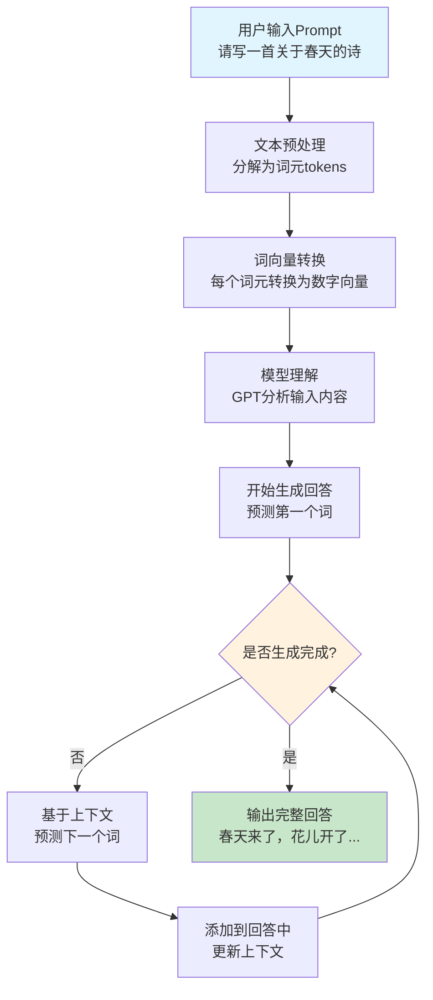
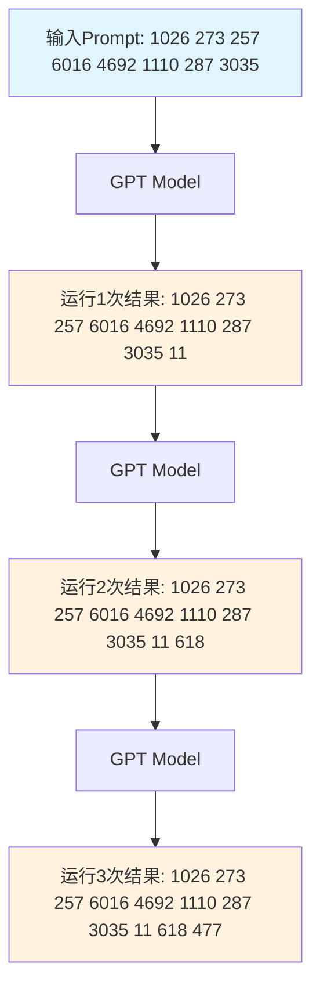

# Prompt Engineering 原理与实践

## 1. Prompt 原理详解

### 1.1 基本工作原理
• **词向量转换**：GPT在处理Prompt时，将输入的文本（Prompt）转换为一系列的词向量（token embeddings）
• **自回归生成**：模型通过自回归生成过程逐个生成回答中的词汇
• **上下文预测**：在生成每个词时，模型基于输入的Prompt以及前面生成的所有词来进行预测
• **迭代完成**：这个过程不断重复，直到模型生成完整的回答



**流程图说明**：
1. **输入阶段**：用户输入Prompt，比如"请写一首关于春天的诗"
2. **预处理阶段**：系统将文本分解为词元（tokens）
3. **向量化阶段**：每个词元转换为数字向量，便于模型理解
4. **理解阶段**：GPT模型分析输入内容，理解用户意图
5. **生成阶段**：模型开始逐个生成回答中的词汇
6. **迭代阶段**：每生成一个词，都会基于已有内容预测下一个词
7. **输出阶段**：当生成完成时，输出完整的回答

### 1.1.1 自回归生成Token流程（可视化）

下图展示了GPT模型如何通过自回归方式逐步生成输出token的过程：



**图示说明**：
- 每次运行，模型会在已有token序列后预测并生成下一个token。
- 新生成的token会被追加到序列末尾，作为下一步的输入。
- 这个过程不断迭代，直到生成完整的输出。

### 1.2 技术细节
• **Tokenization**：文本首先被分解为tokens（词元）
• **Embedding**：每个token被转换为高维向量表示
• **Attention机制**：模型使用注意力机制关注输入的不同部分
• **概率分布**：模型为下一个token生成概率分布
• **采样策略**：根据概率分布选择下一个token（贪婪搜索、束搜索、温度采样等）

## 2. Prompt Engineering 的重要性

### 2.1 核心价值
一个有效的Prompt可以：
• **提升AI模型给出的答案的质量**：更准确、更相关的回答
• **缩短与AI模型的交互时间**：减少迭代次数，提高效率
• **减少误解**：提高沟通的顺畅度和准确性
• **控制输出格式**：确保输出符合特定要求
• **引导模型行为**：让模型按照预期方式工作

### 2.2 实际应用场景
• **内容创作**：文章写作、创意生成、代码编写
• **数据分析**：数据解释、报告生成、洞察发现
• **客户服务**：自动回复、问题解答、个性化推荐
• **教育培训**：个性化学习、知识问答、技能评估

## 3. Prompt Engineering 最佳实践

### 3.1 基本原则
1. **明确性**：使用清晰、具体的指令
2. **上下文**：提供足够的背景信息
3. **约束性**：设定明确的输出格式和限制
4. **迭代性**：通过多次测试优化Prompt

### 3.2 常用技巧
• **角色设定**：让AI扮演特定角色（如专家、教师等）
• **示例引导**：提供few-shot示例
• **格式要求**：明确指定输出格式（JSON、表格、列表等）
• **质量要求**：设定质量标准（详细程度、专业水平等）

### 3.3 常见模式
```
角色 + 任务 + 上下文 + 格式要求 + 质量标准
```

## 4. 实际示例

### 4.1 基础示例
**原始Prompt**：
```
写一篇关于人工智能的文章
```

**优化后的Prompt**：
```
你是一位资深科技记者，请为《科技前沿》杂志写一篇1500字的文章，主题是"人工智能在医疗领域的应用前景"。文章需要包含：
1. 当前AI在医疗中的主要应用
2. 未来5年的发展趋势
3. 面临的挑战和机遇
4. 对医疗行业的影响

请使用通俗易懂的语言，适合普通读者阅读。文章结构要清晰，包含引言、正文和结论。
```

### 4.2 代码生成示例
**原始Prompt**：
```
写一个Python函数
```

**优化后的Prompt**：
```
请用Python编写一个函数，实现以下功能：
- 函数名：calculate_fibonacci
- 参数：n (整数，表示要计算的斐波那契数列项数)
- 返回值：包含前n项斐波那契数列的列表
- 要求：使用递归方法实现，包含错误处理（n必须为正整数）
- 添加详细的函数文档字符串
- 包含使用示例

请确保代码符合PEP 8规范。
```

## 5. 常见问题与解决方案

### 5.1 输出不准确
**问题**：AI回答偏离预期
**解决**：
• 提供更具体的指令
• 添加约束条件
• 使用示例引导

### 5.2 输出过长或过短
**问题**：回答长度不符合要求
**解决**：
• 明确指定字数限制
• 使用"请简要回答"或"请详细说明"
• 设定具体的输出结构

### 5.3 格式不符合要求
**问题**：输出格式混乱
**解决**：
• 明确指定输出格式
• 提供格式示例
• 使用结构化指令

## 6. 进阶技巧

### 6.1 Chain of Thought (思维链)
让AI展示推理过程：
```
请一步步分析这个问题，展示你的思考过程：
[问题描述]
```

### 6.2 Few-shot Learning
提供多个示例：
```
示例1：[输入] -> [输出]
示例2：[输入] -> [输出]
现在请处理：[新输入]
```

### 6.3 温度控制
通过提示词控制创造性：
• 低温度：更确定、一致的回答
• 高温度：更创造性、多样化的回答

## 7. 工具和资源

### 7.1 在线工具
• **ChatGPT Playground**：测试和优化Prompt
• **PromptBase**：分享和发现优质Prompt
• **OpenAI API Playground**：专业开发环境

### 7.2 学习资源
• **OpenAI官方文档**：Prompt Engineering指南
• **Anthropic Claude文档**：Constitutional AI原理
• **学术论文**：最新的Prompt Engineering研究

## 8. 总结

Prompt Engineering是AI时代的重要技能，它不仅是技术问题，更是沟通艺术。通过掌握Prompt Engineering的原理和技巧，我们可以：
• 更好地利用AI工具
• 提高工作效率
• 获得更准确、更有价值的AI回答
• 在AI时代保持竞争力

持续学习和实践是掌握Prompt Engineering的关键。随着AI技术的不断发展，Prompt Engineering的方法和技巧也会不断演进，需要我们保持开放和学习的心态。